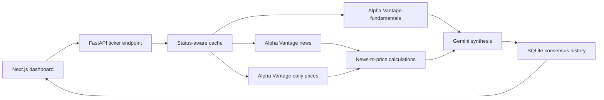

# Kyouth Market Consensus Machine

A hackathon-oriented market intelligence dashboard that combines company fundamentals, recent news sentiment, daily price movement, and AI synthesis into a Bull vs. Bear consensus view.

The project uses free-tier APIs, so data should be treated as the **latest available data**, not a real-time market feed or trading system.

## What It Does

For a selected ticker, Sentinel:

1. Checks the local analysis cache.
2. Fetches company fundamentals, recent news, and daily prices from Alpha Vantage.
3. Measures price reactions around available news publication dates.
4. Sends the collected evidence to Gemini for structured synthesis.
5. Stores the result in a host-mounted SQLite database.
6. Displays sentiment, risk, bull/bear cases, sources, and price context in Next.js.



## Project Structure

- `frontend/src/app/page.tsx`: main dashboard, search flow, price chart, and consensus display.
- `frontend/src/app/ticker/[symbol]/page.tsx`: server-rendered ticker detail page.
- `backend/src/main.py`: FastAPI routes.
- `backend/src/services/pipeline.py`: provider calls, AI synthesis, and persistence.
- `backend/src/services/market_movement.py`: daily-return and news-event calculations.
- `backend/src/services/analysis_coordinator.py`: cache policy and duplicate-request protection.
- `backend/src/models/stock.py`: persisted consensus model.
- `backend/src/consensus.db`: SQLite database used by the running Docker backend.

## Requirements

For the standard Docker workflow:

- Docker with Docker Compose
- Gemini API key
- Alpha Vantage API key

For optional local dependency setup:

- Python 3.14 and `uv`
- Node.js 22 and npm

For host-side database inspection:

- `sqlite3`

## Environment Setup

Create the root `.env` file from the provided template:

```bash
cp .env.example .env
```

Add your free-tier API keys:

```env
GEMINI_API_KEY=your_gemini_api_key
ALPHA_VANTAGE_API_KEY=your_alpha_vantage_api_key
MOCK_EXTERNAL_APIS=false
```

Set `MOCK_EXTERNAL_APIS=true` when you want to demo the UI without spending API requests. Do not commit `.env`; it is ignored by Git.

## Start The App

Build and start both containers in the background:

```bash
make start
```

`make run` is kept as an alias for the same command.

Useful commands:

```bash
make logs       # follow backend and frontend output
make status     # show container status
make restart    # rebuild/restart the app
make stop       # stop the app
make help       # list available commands
```

Access points:

- Dashboard: [http://localhost:3000](http://localhost:3000)
- Backend API: [http://localhost:8000](http://localhost:8000)
- API documentation: [http://localhost:8000/docs](http://localhost:8000/docs)

## Optional Local Setup

To install local dependencies for editor support and running checks outside Docker:

```bash
make setup
```

This runs `uv sync` in `backend`, runs `npm install` in `frontend`, and creates `.env` from `.env.example` when needed.

## Database

The backend mounts the entire host directory `backend/src` at `/app/src` inside the container. Because the configured database URL is `sqlite:///./src/consensus.db`, the application database is directly available on the host at:

```text
backend/src/consensus.db
```

Open it from the project root without entering the container:

```bash
make db
```

Or inspect it directly:

```bash
sqlite3 backend/src/consensus.db
```

Common SQLite commands:

```sql
.tables
.schema stockconsensus
SELECT id, ticker, analysis_status, fetched_at
FROM stockconsensus
ORDER BY fetched_at DESC;
```

You can print the table schema without opening an interactive session:

```bash
make db-schema
```

Stopping or rebuilding the containers does not delete this database because it lives in the host workspace.

## Cache And API Usage

The application is intentionally conservative with free-tier calls:

- Complete analyses are cached for 24 hours.
- Successful local-AI fallback analyses are cached for 24 hours.
- Partial analyses, such as rate-limited news or missing price data, are cached for 1 hour.
- Unavailable analyses are not cached.
- Concurrent requests for the same ticker share one pipeline execution in the current backend process.

A fresh ticker analysis can make three Alpha Vantage requests: fundamentals, news, and daily prices. Requests are sequential to reduce free-tier throttling. Cached searches do not repeat these calls.

## Analysis Status

Each record includes an `analysis_status`:

- `complete`: all expected provider data and Gemini synthesis succeeded.
- `partial`: one or more provider inputs were unavailable or rate-limited.
- `fallback`: provider data succeeded, but Ollama generated the synthesis after Gemini failed.
- `unavailable`: both AI synthesis paths failed; a neutral placeholder was stored.

Provider and synthesis errors are retained in `analysis_error` for debugging.

## Limitations

- This is a hackathon concept, not investment advice or a real-time trading platform.
- Free-tier APIs can return delayed, incomplete, or rate-limited responses.
- News-to-price calculations show association around publication dates, not proof that an article caused a price move.
- Alpha Vantage is the primary external market-data source, so provider coverage and bias carry into the analysis.
- SQLite and process-local ticker locks are appropriate for the current single-worker demo, not a distributed production deployment.
- AI summaries can still be incomplete or incorrect and should be checked against their original sources.
