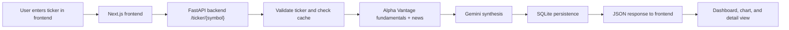

# Kyouth_Market_Consensus_Machine

An automated financial intelligence system that combines market fundamentals, live sentiment, and AI synthesis into a Bull vs. Bear consensus dashboard.

## Project Overview

### Problem Statement
Investors and analysts often need to correlate structured company data with unstructured market sentiment, but those signals are usually spread across multiple tools and sources. This project reduces that friction by turning raw market inputs into a single consensus view.

### Target Users
- Retail investors who want a fast summary of a stock.
- Analysts who want a lightweight synthesis layer over fundamentals and news.
- Developers who need a local, containerized market-analysis demo.

### System Goal
Provide a simple web app that fetches market data for a ticker, runs AI-driven synthesis, stores the result, and presents a readable bullish/bearish consensus with supporting evidence.

## System Architecture

### Data Flow



Input: ticker symbol from the dashboard or ticker page.

Processing: the backend validates the symbol, checks for cached results, fetches external market data when needed, sends a prompt to Gemini, then stores the structured result in SQLite.

Output: the frontend renders a summary card, sentiment indicators, supporting bull/bear cases, source links, and historical data views.

### Module Breakdown
- `frontend/src/app/page.tsx`: landing page, search flow, dashboard cards, and chart rendering.
- `frontend/src/app/ticker/[symbol]/page.tsx`: detailed ticker view with sentiment summary and analysis sections.
- `backend/src/main.py`: FastAPI routes, cache policy, and request orchestration.
- `backend/src/services/pipeline.py`: Alpha Vantage fetches, Gemini synthesis, and database persistence.
- `backend/src/models/stock.py`: SQLModel schema for stored consensus records.
- `backend/src/database.py`: SQLite engine setup and session dependency.
- `backend/src/config.py`: environment-backed settings.

## Setup & Installation

### Prerequisites
- Docker and Docker Compose.
- Python 3.14 tooling if you want to run the backend locally.
- Node.js 22 if you want to run the frontend locally.
- API keys for Gemini and Alpha Vantage.

### Environment Setup
Create a `.env` file in the repository root and add:

```env
GEMINI_API_KEY=your_gemini_api_key_here
ALPHA_VANTAGE_API_KEY=your_alpha_vantage_api_key_here
```

If you want live API calls in Docker, make sure the mock flag is disabled before starting the stack.

### Run With Docker
Start the full system with:

```bash
make run
```

Stop it with:

```bash
make stop
```

Clean local caches and virtual environments with:

```bash
make clean
```

### Local Development
The Makefile also supports local dependency setup:

```bash
make setup
```

This installs backend dependencies with `uv`, installs frontend dependencies with `npm`, and creates a local `.env` from the example file when available.

### Access Points
- Frontend Dashboard: http://localhost:3000
- Backend API: http://localhost:8000
- API Docs: http://localhost:8000/docs

## Features

- Ticker search and consensus retrieval: users can request a stock symbol and get the latest stored or newly generated analysis.
- Fundamental and sentiment harvesting: the backend queries Alpha Vantage for company overview and news sentiment data.
- AI synthesis: Gemini converts raw market inputs into structured bull and bear perspectives.
- Cached analysis records: recent results are reused for 24 hours to reduce API calls.
- Historical ticker views: the API exposes both latest-per-ticker and full ticker history endpoints.
- Frontend sentiment visualization: the UI normalizes backend responses into readable sentiment, risk, and chart views.
- Local persistence: analysis records are saved in SQLite for later retrieval.

## Technical Decisions

- FastAPI was chosen for a small, explicit backend that keeps request orchestration easy to follow.
- SQLModel and SQLite were used to minimize setup overhead and keep the demo self-contained.
- The backend caches recent results for 24 hours to reduce repeated external calls and improve responsiveness.
- The frontend uses Next.js with client-side charting to keep the dashboard interactive.
- Gemini is used as the synthesis layer rather than trying to hard-code heuristics for sentiment combination.
- The system favors a simple local Docker workflow over a more distributed production deployment, which keeps onboarding easier but limits durability and scale.

## Limitations

- Chart Rendering Quirks: The frontend Recharts container can occasionally emit a width/height warning when measured before the layout completely settles. While the chart still renders successfully, the layout lifecycle needs hardening.

- External API Bottlenecks: Alpha Vantage rate limits (especially on free tiers) can throttle live pipeline runs, even with sequential fetching and our 24-hour database caching strategy.

- Single-Source Bias: Currently, the system relies exclusively on Alpha Vantage for both fundamental data and news sentiment. This creates a blind spot for "unofficial" retail market psychology.

- LLM Context Limits & Hallucinations: While the pipeline processes up to 25 recent articles, massive news days could exceed optimal token windows. Furthermore, Gemini failures currently fall back to a generic, static analysis object—keeping the app alive but temporarily reducing the quality of the insights.

- Database Concurrency: The project uses SQLite for ease of setup. While perfect for a local demo, SQLite locks the entire database during writes, which would cause bottlenecks if multiple users triggered the pipeline simultaneously in a production environment.

## Future Improvements

- Alternative Data Integration (Web Scraping): Expand the ingestion pipeline beyond official news APIs to include "alt-data" sources. Scraping subreddits (like r/WallStreetBets) or other social platforms will capture retail momentum, irrational exuberance, and non-official risk indicators, creating a much more accurate "Market Psychology" perspective.

- Interactive "Wikipedia-Style" Glossary: Enhance the frontend UI by having the AI automatically identify and wrap complex financial jargon (e.g., "EBITDA", "Short Squeeze", "P/E Ratio") in hoverable tooltip components. This allows users to view dynamic, context-aware definitions without leaving the dashboard.

- Rich Multi-Layered Data Visualization: Upgrade the existing Recharts sentiment graph by overlaying additional data points. Future iterations could plot trading volume, moving averages, or spikes in social media mentions directly against the price and sentiment trendlines.

- Robust Production Infrastructure: Migrate from local SQLite to a robust PostgreSQL database using Alembic for automated schema migrations. Implement persistent Docker volumes to ensure data durability across container restarts.

- Resilient AI Error Handling: Improve the AI fallback mechanism to provide partial insights (e.g., returning fundamental analysis even if the news sentiment extraction fails) rather than defaulting to a completely generic response.

## Database Inspection

The backend container includes `sqlite3`. The default database file is `consensus.db` in the backend working directory, so you can inspect it with:

```bash
docker exec -it <backend_container_name> sqlite3 /app/consensus.db
```
